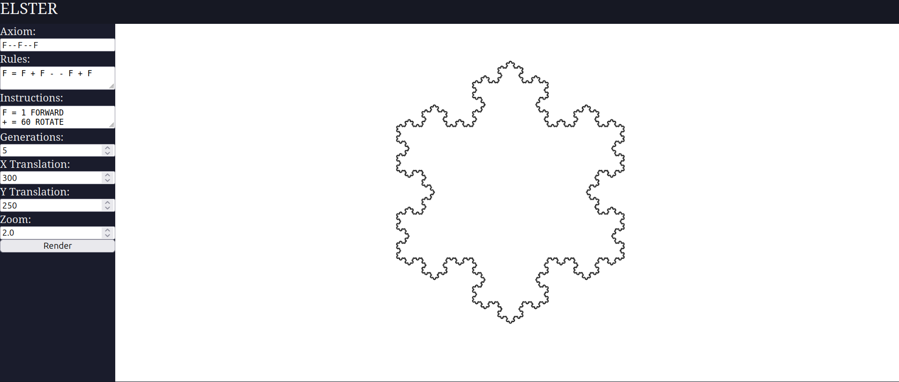

# elster
An L-system plotter for folks who like pretty pictures.

⚠️ Very Early stage of development ⚠️

## FAQ

### What even is this?

- A simple, slow-ish fractal generator using [L-systems](https://en.wikipedia.org/wiki/L-system) and WebGL2.

### How does it work?

**elster** works by:
- expanding a user-specified [L-system](https://en.wikipedia.org/wiki/L-system);
- converting the final list of symbols into supported [turtle commands](#turtle-commands) (see [Turtle](https://en.wikipedia.org/wiki/Turtle_graphics));
- rendering everything to a WebGL2 context.

## Turtle commands

**elster** uses a [Forth-like](https://esolangs.org/wiki/Forth) stack machine, where each command acts on the "Cursor"/"Turtle" in a certain way (moving it, rotating it etc.). It may (but is not required to) produce a drawing primitive to be rendered (a line for example).

### Commands

- {STEPS: number} FORWARD: move the turtle STEPS steps in the direction it is facing.

- {ANGLE: number} ROTATE: change the direction the turtle is facing by ANGLE degrees

### Drawing primitives

- Line (thickness, color)